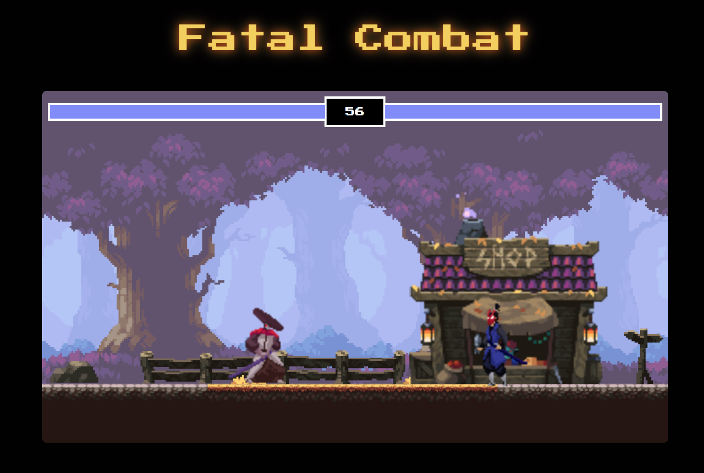
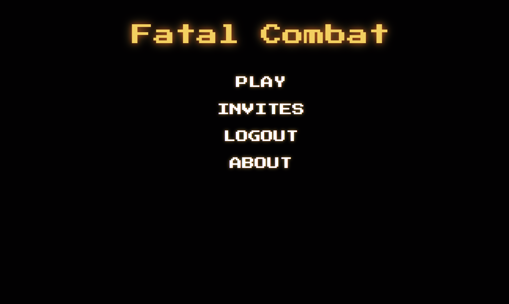

# Fatal Combat ⚔️  
A retro-style 2D fighting game built with Vue 3 + TypeScript on the frontend and FastAPI + SQLModel on the backend. Features include local multiplayer, online battles, real-time WebSocket gameplay, room invites, CPU AI, JWT auth, and smooth canvas animations. The project uses Pinia, PrimeVue, Canvas, TanStack Query, Vite, Docker, Nginx, and AWS for deployment.

## Live Instance
Play the game online at: [https://fatal-combat.esheleyni.com](https://fatal-combat.esheleyni.com/)

## Setup  
Frontend:  
```bash
cd frontend
npm install
npm run dev
```

Backend:
```bash
cd backend
pip install -r requirements.txt
uvicorn main:app --reload
```

## Screenhots


